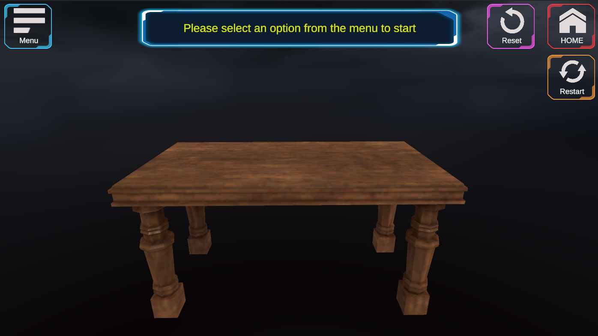
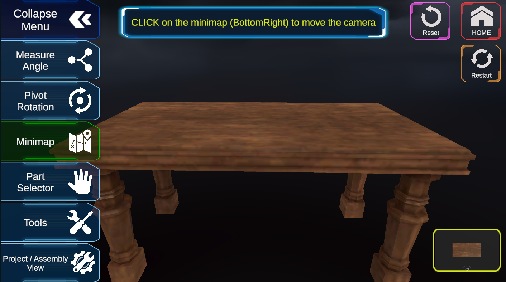
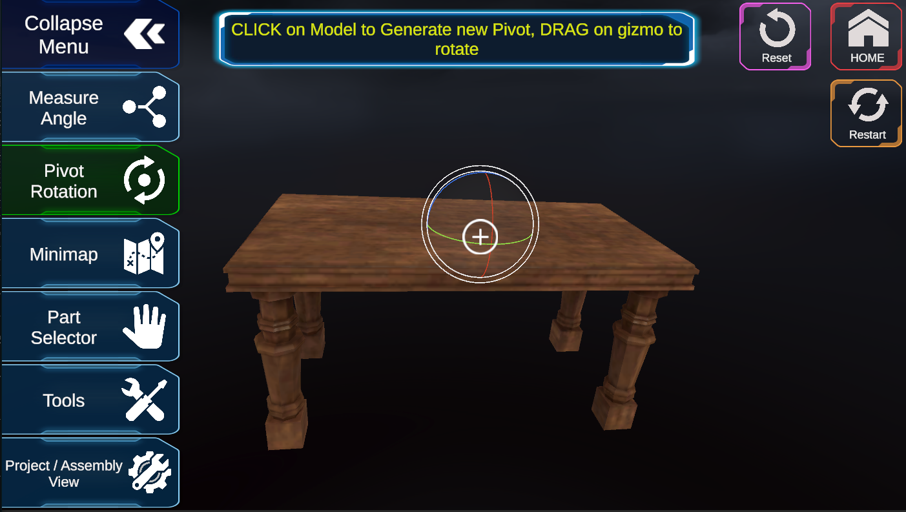
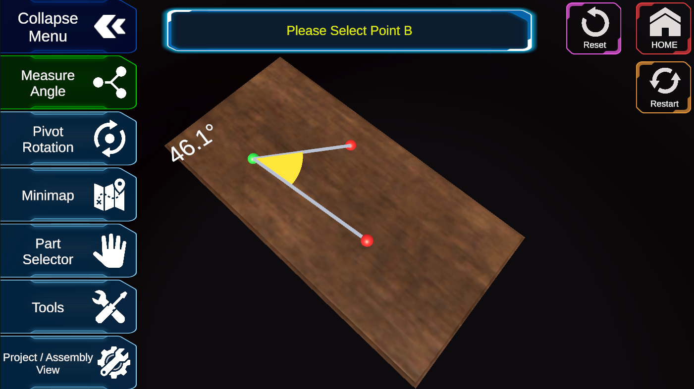

# Game State & UI Management System

## Overview
This Unity project introduces a **comprehensive system** for game state management, UI interactions, and 3D viewer functionality. Built for ease of use and modularity, it enhances user experience through **state-driven controls**, dynamic UI interactions, and responsive 3D tools.

[Watch Demo](https://1drv.ms/v/c/620e69615af8077e/EYilltzRixZMs0k-ytYbbpYBfAfmRf02Laez2I5hW1ymWg?e=AiXFep)

<video src="videos/Demo.mp4" width="600" controls>


## Features
### 🎮 **Game State Manager (Singleton)**
- Handles multiple states like **Measure Angle, Pivot Rotation, Minimap, Part Selector, Tools, and View Change**.
- Uses a **Singleton pattern** for global access and maintains state transitions.
- Logs **state changes** using the custom `LogTools`.

### 📏 **3D Point Selection with Angle Display**
- Allows selecting **three points** on a 3D model.
- Dynamically **calculates and displays angles** between selected points.
- **Visual representation** includes:
  - Connecting lines between points.
  - A **filled arc** to indicate the angle.
  - **Real-time updates** when points move or change.

### 🔄 **Dynamic Pivot Change & Rotation**
- Allows **clicking on any part** of a model to set a **new pivot** point.
- Rotates around the **new pivot** when dragged.
- Ensures **stable positioning** when pivot changes.
- Displays a **small marker** to indicate the current pivot.

### 🗺️ **Mini-Map System**
- Implements a **top-down orthographic minimap**.
- Allows **clicking anywhere** on the mini-map to move the camera.
- Maintains **camera focus within model boundaries**.
- Supports **smooth camera transitions** for seamless navigation.

### 🎭 **UI & Interaction Enhancements**
- **Toggle system** for switching between UI panels.
- UI elements **block raycasts** correctly.
- **Unity Events integration** for easy event-driven functionality.
- **Scene restart button** for seamless reloading.
- 
- 
- 
- 


---

## Installation & Setup
1. **Clone the repository** using:
   ```bash
   git clone <repo-url>
